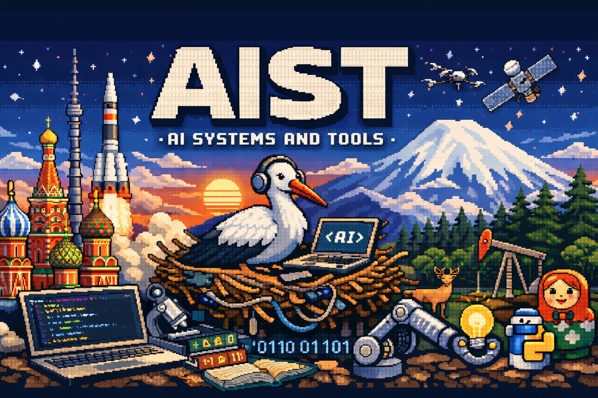

  

> [!TIP]
> Cобираем AI-системы шаг за шагом.

# 🚀 AIST Lab

AIST Lab — это практическая open-source платформа, где вы шаг за шагом собираете реальные AI-системы.

Финал — production-сервис, который можно показать работодателю или запустить в компании.

> [!NOTE]
> **Стек** — Python, FastAPI, Qdrant, PostgreSQL, Docker + docker-compose.

## 🗺 Как устроено обучение

Платформа состоит из модулей, каждый — короткие лабораторные с краткой теорией и готовым результатом.

0. Начало
→ первый API-запрос, свой AI-помощник, анализ данных — без настройки среды

1. Инструменты
→ Python, Docker, модели (YandexGPT, GigaChat, open-source), выбор под задачу

2. Поиск
→ embeddings, hybrid search, reranking

3. RAG
→ RAG от простого к production

4. Агенты
→ function calling, интеграции, агент по законодательству

5. Работа с документами
→ OCR, таблицы, PDF, классификация, NER, российский документооборот

6. Fine-tuning
→ когда нужен, как делать на русскоязычных данных

7. Итоговый проект
→ собственная система: ТЗ - архитектура - демо

## Что внутри каждого модуля

### Module 0 · Начало

### Module 1 · Инструментарий

### Module 2 · Поиск

### Module 3 · RAG

### Module 4 · Агенты

### Module 5 · Данные

### Module 6 · Fine-tuning

### Module 7 · Итоговый проект
