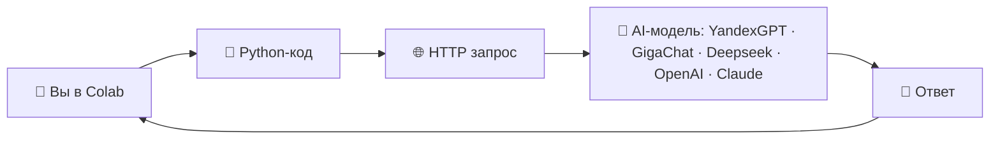
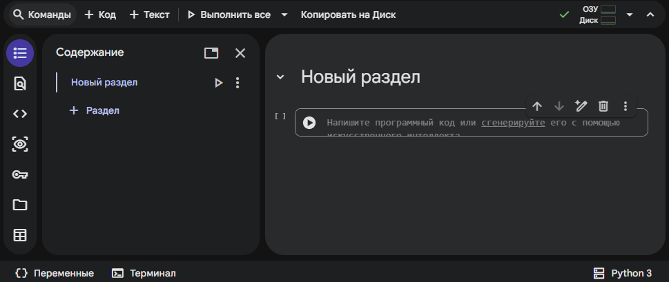

# Первый запрос к AI (Лабораторная 01)

## Тема

Понимание, что AI — это просто HTTP-запрос + текст.

## Цель

Отправляем запрос через API и получаем ответ.

## Теория

### Что такое Jupyter Notebook

Jupyter Notebook — формат интерактивных документов с кодом и текстом.

- Каждая «ячейка» — кусок кода.
- Запускаем по очереди.

<details>

<summary>Подробнее</summary>

**Jupyter Notebook** — это открытое веб-приложение для интерактивных вычислений, позволяющее создавать и обмениваться документами, содержащими исполняемый код, формулы, визуализации и текстовые пояснения. Оно стало стандартным инструментом в области науки о данных, образования и исследований благодаря своей гибкости и поддержке многих языков программирования.

#### Ключевые факты

- **Разработчик**: Project Jupyter (некоммерческая организация).
- **Первый выпуск**: 2015 год.
- **Лицензия**: BSD (модифицированная).
- **Формат файлов**: .ipynb — JSON-документы с кодом и выводом.
- **Языки**: более 40 языков (по умолчанию Python, также R, Julia и др.).

#### История и происхождение

Jupyter Notebook вырос из проекта IPython, созданного в 2001 году Фернандо Пересом. В 2014 году из него выделился Project Jupyter, названный в честь трёх основных языков — Julia, Python и R. В 2017 году проект получил премию ACM Software System Award за вклад в развитие интерактивных вычислений.

#### Архитектура и компоненты

Приложение построено по модели клиент–сервер: веб-интерфейс взаимодействует с ядром (kernel), которое исполняет код и возвращает результат. Документы состоят из ячее́к — Code, Markdown и Raw — и сохраняются в формате .ipynb. Система расширяется через модули и дополнения, а обмен данными между компонентами основан на Jupyter Protocol (передача сообщений JSON поверх ZMQ и WebSockets)

#### Основные возможности

- Интерактивное выполнение и немедленная визуализация результатов.
- Поддержка множества языков через ядра.
- Экспорт в HTML, PDF и Markdown.
- Интеграция с библиотеками NumPy, pandas, Matplotlib, TensorFlow и др.
- Совместное использование через GitHub, Dropbox или JupyterHub.

#### Применение и экосистема

Jupyter Notebook используется для анализа и визуализации данных, прототипирования моделей машинного обучения, подготовки учебных материалов и презентаций. Расширенный интерфейс JupyterLab предлагает современную среду разработки с множеством вкладок, а JupyterHub обеспечивает многопользовательский доступ в корпоративных и учебных средах.

</details>

### Что такое Colab

Google Colab — это бесплатный онлайн-Python-Notebook от Google.

Он работает прямо в браузере:

- не нужно ставить Python

- не нужно настраивать окружение

- можно запускать код по кнопке ▶

Иначе говоря, Colab — это облачная версия Jupyter.

<details>

<summary>Подробнее</summary>

**Google Colab** (сокр. от Google Colaboratory) — это облачная среда программирования на базе Jupyter Notebook, предоставляемая компанией Google. Она позволяет писать и выполнять код на Python прямо в браузере без установки дополнительного ПО, обеспечивая бесплатный доступ к вычислительным ресурсам GPU и TPU.

Платформа широко используется в обучении, исследовательской деятельности и проектировании систем машинного обучения — от учебных примеров до научных экспериментов.

#### Ключевые факты

- **Разработчик**: Google Research
- **Запуск**: 2017 год
- **Основа**: Jupyter Notebook (Open Source)
- **Вычислительные ресурсы**: CPU, GPU, TPU
- **Интеграции**: Google Drive, GitHub, Vertex AI

#### Возможности и функции

Colab объединяет исполняемый код, текст, формулы и визуализации в едином документе (.ipynb). Пользователь может делиться ноутбуками через Google Drive, работать совместно в реальном времени и подключать популярные библиотеки — TensorFlow, PyTorch, NumPy и другие. Для участников проектов с большими нагрузками предлагаются платные тарифы Colab Pro, Pro+ и Pay As You Go с увеличенными лимитами и приоритетным доступом к оборудованию.

#### Варианты использования

Colab применяется в образовании (обучение Python и Data Science), в исследовательских проектах по машинному обучению, для анализов данных, а также как быстрая среда прототипирования. Платформа активно используется миллионами пользователей по всему миру и считается одним из основных инструментов демократизации доступа к ИИ-разработке.

</details>

### Как это работает



- ваш код отправляет текст
- сервер AI генерирует ответ
- вы получаете JSON

## Практика

> [!NOTE]
> Для работы с Colab требуется Google аккаунт.

### Заходим в Colab

- зайти на [Colab](https://colab.research.google.com/)
- войти под учётной записью Google
- создать раздел и вставить кодовую ячейку

<p align="center">
  
</p>

### Получаем API ключ

Для работы с сервисами YandexGPT, GigaChat, OpenAI и т.д. требуется "ключ" по которому определяется, что это именно вы делаете запрос к сервису

У каждого сервиса получение ключа отличается и нужно смотреть официальную документацию от них

Как пример:
- [YandexGPT](https://yandex.cloud/ru/docs/ai-studio/operations/get-api-key)
- [GigaChat](https://developers.sber.ru/docs/ru/gigachat/quickstart/ind-using-api)

> [!WARNING]
> Могут возникнуть проблемы с получением ключа до иностранных сервисов, на территории РФ, из за санкционной политики.

### Запуск кода

В кодовую ячейку в Colab подставить код (для примера используется GigaChat) и нажать иконку выполнения (▶)

```python
import requests
import urllib3
urllib3.disable_warnings(urllib3.exceptions.InsecureRequestWarning)

ACCESS_TOKEN = "ВАШ_ACCESS_TOKEN"
BASE_URL = "https://gigachat.devices.sberbank.ru/api/v1"

headers = {
    "Authorization": f"Bearer {ACCESS_TOKEN}",
    "Content-Type": "application/json",
}

# Меняй только эту переменную
prompt = "Объясни простыми словами, что такое нейросеть."

data = {
    "model": "GigaChat-Max",
    "messages": [
        {"role": "user", "content": prompt}
    ],
    "temperature": 0.7,
}

response = requests.post(
    f"{BASE_URL}/chat/completions",
    headers=headers,
    json=data,
    verify=False,
    timeout=60
)

response.raise_for_status()
result = response.json()

print(result["choices"][0]["message"]["content"])
```

Получаем ответ

```
Нейросеть — это компьютерная программа, созданная по принципу работы человеческого мозга: она состоит из множества взаимосвязанных элементов (нейронов), которые обрабатывают информацию и учатся решать различные задачи на примерах.

Представь себе сеть друзей в соцсетях: каждый друг получает какую-то новость от нескольких знакомых, делает выводы и передает дальше другим друзьям. Так же работает и нейросеть: каждая её часть («нейрон») принимает сигналы, решает, важно ли сообщение, и отправляет результат следующему элементу сети. Постепенно такая система учится распознавать лица, переводить тексты, прогнозировать погоду или даже играть в шахматы лучше человека!

Главное отличие нейросети от обычных компьютерных программ — способность самостоятельно улучшаться через обучение на реальных примерах.
```

## Результат

Вы запустили py код в Colab и получили ответ от нейросети.

Можете менять значение в переменной prompt, заново запустить код и посмотреть какие ответы выдаёт AI
