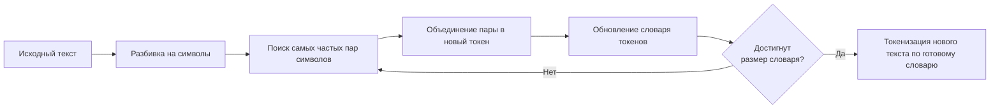

# Prompt engineering (Лабораторная 03)

## Тема

Как формулировать запросы к AI так, чтобы получать:

- точные ответы
- структурированный результат
- проверяемую информацию

## Цель

Научиться управлять поведением модели через:

- роль
- структуру запроса
- примеры
- ограничения
- проверку результата

## Теория

> [!NOTE]
> Плохой ответ — это чаще плохой запрос
> Модель можно направлять

### Термины

#### Что такое prompt

Prompt — это текст, который вы отправляете модели.

Модель не "думает".
Она продолжает текст, исходя из вероятностей.

Чем точнее вход → тем стабильнее выход.

#### Токены

Модель работает не со словами, а с токенами.

Токен ≠ слово.

К модели поступает prompt и перед тем как начать с ним работать, она разбивает его на токены.

<details>
<summary>Подробнее</summary>
Модель использует алгоритм токенизации — чаще всего BPE (Byte Pair Encoding) или его модификации.

**Если кратко, то как это работает:**

1. Текст сначала разбивается на отдельные символы.
2. Затем алгоритм постепенно объединяет самые частые пары символов.
3. В результате формируется словарь устойчивых фрагментов текста.
4. Новый текст разбивается не на слова, а на эти фрагменты — токены.

Например, если сочетание «обуч» часто встречается, оно станет одним токеном.

Редкие слова могут разбиваться на несколько частей.



</details>

Обычно:

- 1 токен ≈ 3–4 символа русского текста

- 1000 токенов ≈ 700–800 слов

Почему это важно:

- лимиты контекста
- стоимость
- длинные запросы “съедают” память

Чем короче и структурированнее prompt — тем лучше.

### Как написать хороший Prompt?

#### Использование ролей (system / user / assistant)

В современных API есть роли:

- system — задаёт поведение модели
- user — запрос пользователя
- assistant — предыдущие ответы модели

Пример:
```json
[
  {"role": "system", "content": "Ты строгий аналитик. Отвечай кратко и по пунктам."},
  {"role": "user", "content": "Объясни, что такое RAG"}
]
```

System — самый сильный уровень управления.

Если его нет — модель отвечает “по умолчанию”.

#### Описывать promt структурно

Структура:

1. Роль
2. Контекст
3. Задача
4. Ограничения
5. Формат ответа

Пример плохого запроса:

```
Расскажи про нейросети
```

Пример хорошего запроса:

```
Ты преподаватель для студентов 1 курса.
Объясни, что такое нейросеть простыми словами.
Используй 5 пунктов.
Без формул.
Объём — до 150 слов.
```

#### Примеры

Модель лучше работает, когда видит примеры формата ответа.

Пример:

```
Вопрос: Что такое API?
Ответ: Короткое объяснение в 3 пунктах.

Вопрос: Что такое embedding?
Ответ:
```

Модель "подхватывает" шаблон.

#### Проверка ответа

Модель может:

- придумывать факты
- уверенно ошибаться
- ссылаться на несуществующие законы

Способы проверки:

- попросить источники
- попросить процитировать текст
- попросить объяснить ход рассуждения
- попросить проверить себя

Пример:
```
Проверь свой ответ и укажи возможные неточности.
```


## Практика

Откройте ноутбук Colab из [предыдущей лабораторной](../lab-01/README.md).

Будем менять только prompt запроса и смотреть, как меняются ответы от модели.

### Шаг 1. Базовый запрос

```python
prompt = "Объясни простыми словами, что такое нейросеть."
```

### Шаг 2. Добавляем роль

```python
prompt = (
    "Ты преподаватель, который объясняет новичку без технического бэкграунда.\n"
    "Объясни простыми словами, что такое нейросеть."
)
```

### Шаг 3. Добавляем структуру

```python
prompt = (
    "Ты преподаватель для новичка.\n"
    "Объясни, что такое нейросеть.\n\n"
    "Структура ответа:\n"
    "1) Определение (1–2 предложения)\n"
    "2) Как это работает (3 пункта)\n"
    "3) Пример из жизни (1 пример)\n"
    "Ограничение: до 120 слов."
)
```

### Шаг 4. Добавляем формат

```python
prompt = (
    "Ты преподаватель для новичка.\n"
    "Объясни, что такое нейросеть.\n\n"
    "Верни ответ строго в формате JSON (без пояснений и лишнего текста):\n"
    "{\n"
    '  "definition": "...",\n'
    '  "how_it_works": ["...", "...", "..."],\n'
    '  "example": "..." \n'
    "}\n"
    "Ограничение: коротко."
)
```

### Шаг 5. Добавляем проверку ответа

```python
prompt = (
    "Ты преподаватель для новичка.\n"
    "Объясни, что такое нейросеть.\n\n"
    "Формат ответа:\n"
    "1) Определение (1–2 предложения)\n"
    "2) Как работает (3 пункта)\n"
    "3) Пример (1 пример)\n\n"
    "Затем сделай самопроверку:\n"
    "- Укажи 2 места, где люди часто ошибаются в понимании нейросетей\n"
    "- Если в ответе есть спорные/неточные формулировки — исправь их\n"
    "Ограничение: до 150 слов."
)
```


## Результат

Итого:

- роль влияет на стиль и глубину
- структура запроса управляет качеством
- примеры стабилизируют формат
- токены — это ресурс
- ответ модели нужно проверять

### Примеры ответов по 5 шагам

#### Шаг 1. Базовый запрос

```
Нейросеть — это компьютерная программа, созданная по принципу работы человеческого мозга: она состоит из множества взаимосвязанных элементов (нейронов), которые обрабатывают информацию и учатся решать разные задачи самостоятельно.

Например, ты можешь показать нейросети много фотографий кошек и собак, чтобы она научилась отличать одно животное от другого. Постепенно она запоминает особенности каждого вида и становится способной распознавать новых животных сама, даже тех, которых раньше не видела.

Таким образом, нейросеть способна учиться на примерах и применять полученные знания для решения различных задач, будь то распознавание изображений, перевод текста или создание музыки.
```

#### Шаг 2. Добавляем роль

```
Представь себе большую компанию сотрудников (нейронов), каждый из которых занимается какой-то маленькой задачей: один смотрит на цвет предмета, другой — на форму, третий — на размер и так далее. Каждый сотрудник получает свою маленькую порцию информации от коллег, обрабатывает её и передаёт дальше другим сотрудникам. В конце концов, вся информация собирается вместе, и компания принимает решение («это яблоко», «это кошка», «это дом»).

Нейронная сеть работает примерно так же! Это компьютерный алгоритм, состоящий из множества маленьких элементов (нейронов). Они получают данные, передают друг другу сигналы, пока не примут итоговое решение. Чем больше нейронов и связей между ними, тем сложнее задачи способна решать такая сеть.

Например, ты показываешь ей фотографию кошки, она разбирает изображение на мелкие детали (цвета, формы, линии), сравнивает с уже известными образцами и решает, что именно изображено. И самое интересное — нейросети умеют учиться самостоятельно, улучшаясь после каждой новой попытки!

Так что, говоря простым языком, **нейросеть** — это система, похожая на мозг человека, состоящая из множества взаимосвязанных элементов, которые совместно решают сложные задачи путём обработки поступающей информации.
```

#### Шаг 3. Добавляем структуру

```
**Нейросеть — это компьютерная система, имитирующая работу человеческого мозга.** Она учится распознавать закономерности, принимать решения и решать задачи через обучение на примерах.

### Как это работает?
- **Обучение:** Нейросеть получает данные и постепенно улучшает свою точность.
- **Слои:** Состоит из множества слоев, каждый обрабатывает информацию особым образом.
- **Прогнозирование:** После обучения сеть способна делать прогнозы или классификации новых данных.

### Пример из жизни  
Представь себе приложение, которое автоматически сортирует фотографии по лицам людей. Это делает именно нейросеть, научившись различать лица после анализа миллионов примеров фотографий.
```

#### Шаг 4. Добавляем формат

```json
{
  "definition": "Нейросеть — это компьютерная система, имитирующая работу человеческого мозга через взаимосвязанные элементы («нейроны»), способные учиться и принимать решения.",
  "how_it_works": [
    "Получает входную информацию (данные).",
    "Обрабатывает её слоями искусственных нейронов.",
    "Выдаёт результат после анализа и вычислений."
  ],
  "example": "Распознавание изображений: нейросеть учится распознавать котиков на фотографиях, сравнивая пиксели и выделяя характерные признаки."
}
```

#### Шаг 5. Добавляем проверку ответа

```
### Нейросеть

**Определение:**  
Искусственная нейронная сеть — вычислительная система, имитирующая работу мозга человека через взаимосвязанные элементы («нейроны»), обрабатывающие данные.

**Как работает:**  
1. **Обучение:** Получает входные данные и корректирует связи между нейронами для улучшения результатов.  
2. **Распознавание закономерностей:** Анализирует большие объемы данных, выявляя скрытые зависимости.  
3. **Прогнозирование:** Применяет полученные знания для предсказания новых ситуаций.

**Пример:**  
Нейросеть распознаёт рукописный почерк, сравнивая введённые символы с образцами, накопленными во время обучения.

---

### Самопроверка

1. Люди путают искусственную нейросеть с биологическим мозгом — это разные системы.  
2. Часто считают, что нейросети сами знают всё после одного примера — нужна большая выборка данных для качественного результата.

(Нет некорректных формулировок.)
```